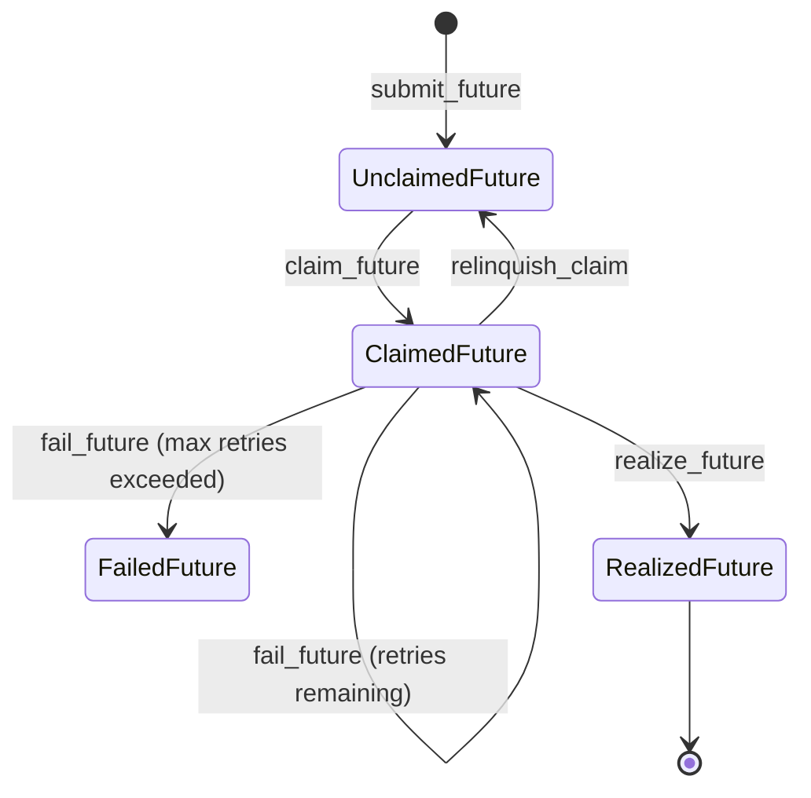

# Intro

A very very minimal distributed futures system written in pure Python on top of FoundationDB, vaguely inspired by Ray. Only three direct dependencies!

**This is just an educational toy for myself. Not for real-world use.** It's also a nice testimonial for the ease-of-use of FoundationDB.

## Quick start

### Install FoundationDB

FoundationDB is used for coordination and discovery of other members of the cluster.

https://apple.github.io/foundationdb/downloads.html

### Start a worker

`poetry run python fdb_ray_clone/worker.py --address=127.0.0.1 --port=50001 demo_cluster_name`

### Create some futures

```python
import fdb_ray_clone.client as client
client.init("demo_cluster_name")
x = client.submit_future(lambda x, y: x + y, 1, 2)
client.await_future(x) # returns 3

# You can close over futures, or pass them into other futures explicitly.
y = client.submit_future(lambda z: client.await_future(x) + client.await_future(z), x)
client.await_future(y) # returns 6

# Exceptions are propagated back to the client
z = client.submit_future(lambda: 1 / 0)
client.await_future(z) # raises RemoteException with ZeroDivisionError and traceback from worker
```

## Features

- Distributed futures executed by a cluster of workers.
- Distributed storage of future outputs.
- Very simple architecture. <1k lines of Python.
- Resource requirement system -- specify that your future needs n CPUs, m bytes of memory, etc.
- Fault tolerant -- retries, exception reporting, detects dead workers and reassigns their work, simple lineage system that can reconstruct lost outputs.

## Data plane

Each worker process is running a Python [SharedMemoryManager](https://docs.python.org/3/library/multiprocessing.shared_memory.html#multiprocessing.managers.SharedMemoryManager), which is a lightweight way to share memory between Python processes over a network. The hello world of SharedMemoryManager examples crashes in my system Python [because of a bug](https://stackoverflow.com/questions/59172691/why-do-we-get-a-nameerror-when-trying-to-use-the-sharedmemorymanager-python-3-8), so this requires Python >3.8.

The SharedMemoryManager configuration **assumes a private network.** `authkey` is set to a constant string.

Each shared memory buffer contains a Python object. There is an optimized write path for PyArrow that uses lz4 compression.

Disk spill is handled transparently by Linux swap (not tested yet). Create a swap file if you want to use it.

## Control Plane

The control plane is mediated by FoundationDB. Each worker and client must be able to reach the FoundationDB cluster.

When a future is submitted, it is written to FoundationDB and indexed by its resource requirements. Workers periodically scan the secondary index of resource requirements to find work that fits within their resource limits, and choose one at random, transactionally removing it from the list to claim the work.

Awaiting a future uses FoundationDB watches internally. It also implements a timeout and (optionally) resubmitting the future if a worker dies.

### Future lifecycle



# High-priority TODOs

- Implement a general put(). See TODO on FutureResult class.
- Implement actors. Method calls on actors could be futures with locality constraints. Actors themselves could either be stored in buffers and deserialized/reserialized on every call (easier, but limiting), or stored separately in the Store.
