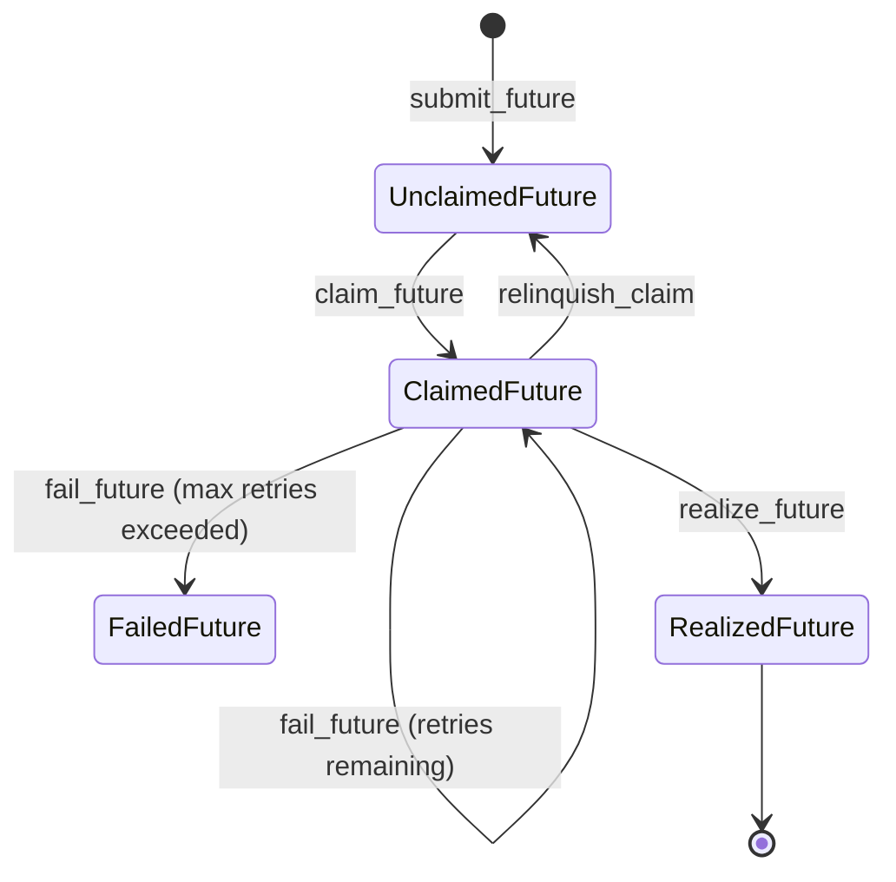

# Intro

A very very minimal distributed futures system written in pure Python on top of FoundationDB, vaguely inspired by Ray. Only three direct dependencies!

**This is just an educational toy for myself. Not for real-world use.** It's also a nice testimonial for the ease-of-use of FoundationDB -- everything as of commit 83ab44dde was implemented in a week.

## Features

- Simple. <2k lines of Python.
- Distributed futures executed by a cluster of workers.
- Distributed storage of future outputs.
- Resource requirement system -- specify that your future needs n CPUs, m bytes of memory, etc.
- Fault tolerant -- retries, exception reporting, detects dead workers and reassigns their work, simple lineage system that can reconstruct lost outputs.

## Quick start

### Install FoundationDB

FoundationDB is used for coordination and discovery of other members of the cluster.

https://apple.github.io/foundationdb/downloads.html

### Start a worker

`poetry run python fdb_ray_clone/worker.py --address=127.0.0.1 --port=50001 demo_cluster_name`

Start as many as you want, but use a different port for each one. Each worker polls FoundationDB for futures to execute, stores the results in its memory, and serves the results from the given address and port.

### Create some futures

The client API writes futures to FoundationDB, uses FoundationDB watches to be notified when a worker has finished a future, and then connects directly to the worker's [SharedMemoryManager](https://docs.python.org/3/library/multiprocessing.shared_memory.html#multiprocessing.managers.SharedMemoryManager) to fetch the result.

See [the future docs](./docs/futures.md) for the details of how futures are implemented.

```python
import fdb_ray_clone.client as client

client.init("demo_cluster_name")
x = client.submit_future(lambda x, y: x + y, 1, 2)
client.await_future(x)  # returns 3

# You can close over futures, or pass them into other futures explicitly.
y = client.submit_future(lambda z: client.await_future(x) + client.await_future(z), x)
client.await_future(y)  # returns 6

# Exceptions are propagated back to the client
z = client.submit_future(lambda: 1 / 0)
client.await_future(
    z
)  # raises RemoteException with ZeroDivisionError and traceback from worker

```

### Create an actor

See [the docs](./docs/actors.md) for more about how actors were implemented.

```python
import fdb_ray_clone.client as client

client.init("demo_cluster_name")

class Foo:
    def __init__(self, x: int):
        self.x = x
    def foo(self, y: int) -> int:
        return self.x + y

actor_future = client.create_actor(Foo, 1)
actor = client.await_future(actor_future)

call_future = client.call_actor(actor, "foo", 2)
client.await_future(call_future) # returns 3
```

#### Locality requirements

You can require that a future run on the same worker as a previous future, to ensure that the new future has fast access to the previous future's results, without network transfer overhead.

```python

import fdb_ray_clone.client as client

client.init("demo_cluster_name")
x = client.submit_future(lambda x, y: x + y, 1, 2)
client.await_future(x)

locality = client.locality(x)

# If you want to test lineage reconstruction, ctrl-c the
# worker and restart it before running the next line. x
# will get recomputed as part of awaiting y.

y = client.submit_future(
    lambda x, y: client.await_future(x) + y, x, 5, locality=locality
)
client.await_future(y) # returns 8
```

## Data plane

Each worker process is running a Python [SharedMemoryManager](https://docs.python.org/3/library/multiprocessing.shared_memory.html#multiprocessing.managers.SharedMemoryManager), which is a lightweight way to share memory between Python processes over a network. The hello world of SharedMemoryManager examples crashes in my system Python [because of a bug](https://stackoverflow.com/questions/59172691/why-do-we-get-a-nameerror-when-trying-to-use-the-sharedmemorymanager-python-3-8), so this requires Python >3.8.

The SharedMemoryManager configuration **assumes a private network.** There is no auth mechanism.

Each shared memory buffer contains a Python object. There is an optimized write path for PyArrow that uses lz4 compression.

Disk spill is handled transparently by Linux swap (not tested yet). Create a swap file if you want to use it.

## Control Plane

The control plane is mediated by FoundationDB. Each worker and client must be able to reach the FoundationDB cluster.

When a future is submitted, it is written to FoundationDB and indexed by its resource requirements. Workers periodically scan the secondary index of resource requirements to find work that fits within their resource limits, and choose one at random, transactionally removing it from the list to claim the work.

Awaiting a future uses FoundationDB watches internally. It also implements a timeout and (optionally) resubmitting the future if a worker dies.

### Future lifecycle



# High-priority TODOs

- Implement a general put(). See TODO on FutureResult class.

