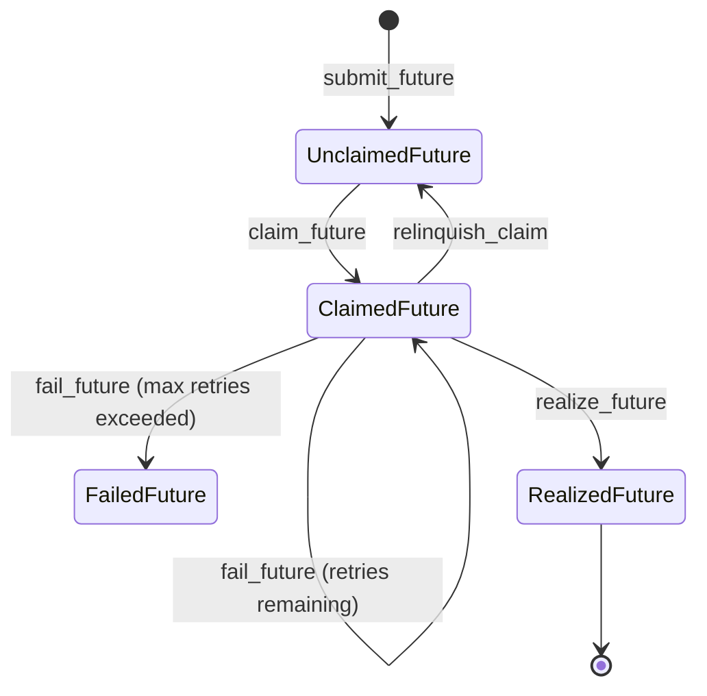

# FDB data model

**All subspaces are contained within a subspace scoped by a user-provided
cluster name.**

## futures subspace

Contains a list of all futures known to the system.

### Invariants

- A future is in one of these mutually exclusive and exhaustive states:
  - Unclaimed (and unrealized) -- `claim` key is not set
  - Claimed (and unrealized) -- `claim` key is set and `latest_result` is not
                                 set or has an earlier timestamp than the claim.
  - Realized -- `claim` key is set and `latest_result` is set, comes from the
                  same worker as the claim, and has a later timestamp than the
                  claim.
  - Failed -- num_attempts > max_retries + 1
- A future can only be claimed by one worker at a time.
- A future's UUID never changes, regardless of any state transitions it undergoes,
  including resubmission when the worker processing it dies.
- If a future is unclaimed, it is present in the resource_requirements_* xor
  the worker_assignments secondary index subspaces (but not both).
- If a future is claimed, its claim key is set.
- A future can be moved from claimed to unclaimed without being realized in two
  ways:
  - The worker that claimed the future voluntarily relinquishes the claim because
    it died and restarted (this is a safety mechanism, just in case the worker
    restarted with different resources and can't process the claim any more).
  - The worker that claimed the future dies and the client or worker awaiting
    the future detects the situation and relinquishes the claim on behalf of the
    dead worker.
- A future can be moved from realized to unclaimed if a worker
  detects that all stored copies of the future's result have been lost by
  worker crashes. This resets num_attempts (TODO: should it?).

### Key/values per future:

- key (`future_id`, 'code'): value: cloudpickled function to run to produce
  the future's result.
- key (`future_id`, 'latest_result'): value: pickled FutureResult object.
  If this key is not present, the future
  has not yet been realized. For a full list of results of this future, see
  the results subspace.
- key (`future_id`, 'args'): value: pickled list of FutureParam objects.
  These are the args of the future, which are passed as parameters to
  the future's function when it runs. If this key is not present, the
  future has no args.
- key (`future_id`, 'num_attempts'): value: pickled int. The number of times
  a worker has attempted to realize a future. If this value is greater than one,
  a worker has encountered an exception while trying to realize the future, or
  has crashed for unrelated reasons (the latter can be inferred by a missing
  exception key; see below).
- key (`future_id`, 'max_retries'): value: pickled int. The number of times
  to retry realizing the future before giving up. If num_attempts >= max_retries,
  the future will never be realized.
- key (`future_id`, 'latest_exception'): value: pickled FutureException object. The exception
  string of the last failure. If this key is not present, the future has never
  failed. If this key is present, the future has failed in the past, but may
  have succeeded since then.
- key (`future_id`, 'requirements'): value: Requirements object. The
  resource or locality requirements needed to realize the future. If this key is not present, any
  worker can realize the future. The values here are kept in sync with the
  resource_requirements_cpu, resource_requirements_ram, resource_requirements_gpu, and
  locality_requirements subspaces, which are secondary indices into the futures subspace.
- key (`future_id`, 'claim'): value: pickled FutureClaim object. The claim on the
  future. If this key is not present, the future has not been claimed. If this
  key is present, the future has been claimed and a worker may be working on
  the future (or the worker may have died). See error handling below for more
  details.

## resource_requirements_* subspace

Contains a list of all futures that require a certain resource. This is ordered
so that workers can easily filter for futures that they have enough resources
to realize. This is a secondary index into the futures subspace.

### Invariants

- All unclaimed futures are included in these secondary indices. If a worker
  relinquishes its claim on a future without realizing it, it must reinsert
  the future into these indices. See the relinquish_claim method for more info.
- Futures are removed from this index when claimed. See the claim_future method.
  This index is the primary means of claiming futures.
- If a future doesn't explicitly require a resource, its requirement will be
  set to 0 and it will be included in this secondary index.
- It is acceptable to read ranges of these indices as snapshot reads, so long
  as claim operations are not snapshot reads. This is because we want only one
  worker to claim a future.

### Key/values per future:

- key (`resource_type`, `resource_requirement`, `future_id`): value: None.

## results subspace

Contains a list of all future results known to the system. For each future,
we list all of its results. There may be more than one if the worker originally
containing the future crashed, or if the user requested the future result to
be cloned to another worker. TODO: implement API for cloning future results.

### Invariants

- If a result exists, the future has a non-null latest_result key.

### Key/values per result:

- key (`future_id`, versionstamp): value: pickled FutureResult object. This contains the
  timestamp at which the result was realized, the worker id, and the name of
  the shared memory object containing the result. **If the timestamp is older
  than the started_at timestamp of the corresponding worker, the object is no
  longer available (the worker has since crashed and restarted). Workers that
  notice this situation should delete this key/value pair.**

## workers subspace

Contains information on all workers that are members of the cluster.

Workers are uniquely identified by IP address and port. A worker that has crashed
and restarted with the same IP address and port is considered the same worker,
though it may no longer contain the realized futures it used to.


### Key/values per worker:

- key (`worker_ip`, `worker_port`, "heartbeat"): value: pickled WorkerHeartbeat object. This
  contains the timestamp of the worker's last heartbeat, the timestamp at which
  the worker started up, and the worker's
  available resources (CPU is constant, RAM is adjusted to account for free space,
  since the worker is storing future results).
- key (`worker_ip`, `worker_port`, "claim_future"): value: pickled future UUID
  indicating the future the worker is currently working on. This is kept in sync
  with the claim key in the futures subspace. If this key is not present, the
  worker is not currently working on a future.

## worker_assignments subspace

Contains a list of all futures that have been assigned to a worker. This can be
considered a special case of the resource_requirements_* subspaces, but it is
only used for futures that must be executed by a particular worker, *because that
worker, at the time the future was submitted, held a particular object*. Most
futures can be executed by any worker, and workers grab work from a shared pool.
Worker assignments are used by clients as either a performance optimization for
data locality, or as a hard requirement, in the special case that the object is
an actor (which is necessarily bound to a single worker because it has state).

Workers are expected to prioritize their assignments over other futures. If an
assignment was given to a worker because of an object reference that the worker
no longer holds, the worker should first check if another copy of the object
(same future_id provenance) is available on another worker. If so, it should
reassign the future to that worker. If not, the worker should resubmit the
future that created the object and instead look for other futures to work on.
On the next iteration of this worker's main loop, this logic will trigger again
and the work will get reassigned to whatever worker claimed the resubmitted future.

There is a tricky case when the objectref is truly lost and the upstream work
needs to be recomputed. The worker that is unable to do the work is responsible
for resubmitting the future, but it cannot await it, because if there is only
one worker, it would deadlock. It would also deadlock the cluster if two workers
reassign lost objectref futures to each other and wait for the results. Actually,
we could avoid deadlock if we always await with timeout, and upon timing out,
try to claim a different future... and choose randomly between assigned futures
and futures from the shared pool. If we are unlucky with the randomness or the
number of retries is low, though, we could still hit problems, and the implementation
complexity for this is high, and I am not sure it would fully solve the problem.

What if we just resubmit the upstream future and don't await? How does the client
waiting for our assigned future learn if the upstream future fails? We could
fail our assigned future with an UpstreamDependencyFailedException describing the situation. Furthermore,
if we see that the upstream future has died, how do we know whether it died
after we resubmitted it, or it died for unrelated reasons, possibly because
someone else resubmitted it? Maybe we simply shouldn't distinguish -- let the
client sort it out if they want to, by again using UpstreamDependencyFailedException.

### Invariants

- If a future is assigned to a worker, it is not included in the resource_requirements_*
  subspaces. This is because we don't want a situation where a future gets stuck because
  it has a locality requirement and a resource requirement that mutually conflict.
- A future is removed from the worker_assignments list for a worker when the
  worker claims it, or when the worker reassigns it to another worker.

### Key/values per future:

- key (`worker_ip`, `worker_port`, "assignment", `future_id`):
  value: pickled ObjectRef object specifying the reason why the future was assigned
  to this worker.

# Error handling and failure modes

The following failures can occur in the future lifecycle:

- The worker that claimed the future has died and restarts. **Solution**: on startup, workers check whether they have an outstanding claim and relinquish it, returning it to the pool of unclaimed futures. This is safer than continuing the work, because the worker may have restarted with different resources and no longer be able to fulfill the request.
- The worker that claimed the future has died and does not restart. **Solution**: when awaiting a future, the client can optionally resubmit the future if the worker's heartbeat has stopped. The downside is that if no one is awaiting the future, it will never be computed. This is deemed acceptable for this system, because its primary intent is data processing. If the intent were to provide fire-and-forget futures with side effects, this could be an unacceptable solution.
- The future code threw an exception. **Solution:** retries, up to a max, followed by transitioning the future to a failed state, which causes the client awaiting the future to throw an exception.
- No worker has the required resources to realize the future. In this case, no
  worker will attempt to claim the future, so it will never fail and never
  succeed. **Not yet solved**. We have heartbeat keys containing the max resources for each worker, so we could
  fail to submit the future if its requirements exceed those maximums. But make sure to only consider live workers when computing maximum resources!
- A future the future depends on has failed permanently (max_retries exceeded). **Solution:** This will throw an exception that will bubble up to the client awaiting the ultimate future.
- A future depends on a successful future, but the worker holding the result of that dependency is dead. **Not solved yet**, but we are very close -- we have a partial lineage reconstruction system for futures with locality requirements. Implementing the same for futures without locality requirements should be easier (just a new flag in the await_future function `resubmit_if_object_lost=True` which should probably be the default).
- The worker fails to deserialize the future code. **Not solved yet.** Low priority because this would only happen under very weird conditions.
- The worker that claimed the future doesn't have enough memory to fulfill the future,
  but retries are always retried on the same worker. Retrying on another worker
  could succeed. **Not solved yet**. This could potentially be detected by catching OutOfMemoryError.
- A future's serialized code exceeds the value size limit of FoundationDB. **Not solved yet.** Low priority because it should be very improbable in practice.

## Future extensions

- API to delete a future's results. We need this to be able to repartition a dataset and clean up the old partitions.
- API to transfer ownership of a future's result to another worker. This
  is also needed for repartitioning.
- API to put something into the object store locally and register it as a
  realized future. This is kinda equivalent to `return` in a monadic future API. This might be a bad idea because objects without provenance info break lineage reconstruction.
- Reference counting and garbage collection.

How repartitioning should work:

```
for each current partition:
  new_partitions = split_into_n_parts(current_partition, n)
  new_partition_futures = []
  transfer_ownership_futures = []
  for new_partition in new_partitions:
    realized_future = put_realized_future(new_partition)
    new_partition_futures.append(realized_future)
    transfer_ownership_future = future(lambda: take_ownership(realized_future), resources={'ram': realized_future.size_in_bytes})
    transfer_ownership_futures.append(transfer_ownership_future)
  await_all(transfer_ownership_futures)
  delete_all(transfer_ownership_futures) # boring cleanup since we don't have GC yet
  delete_future(current_partition)
```
